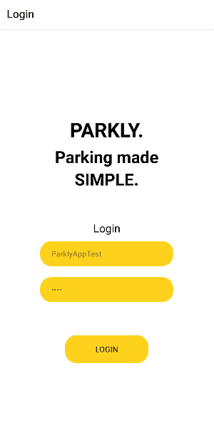
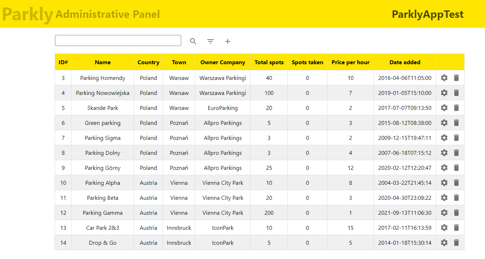
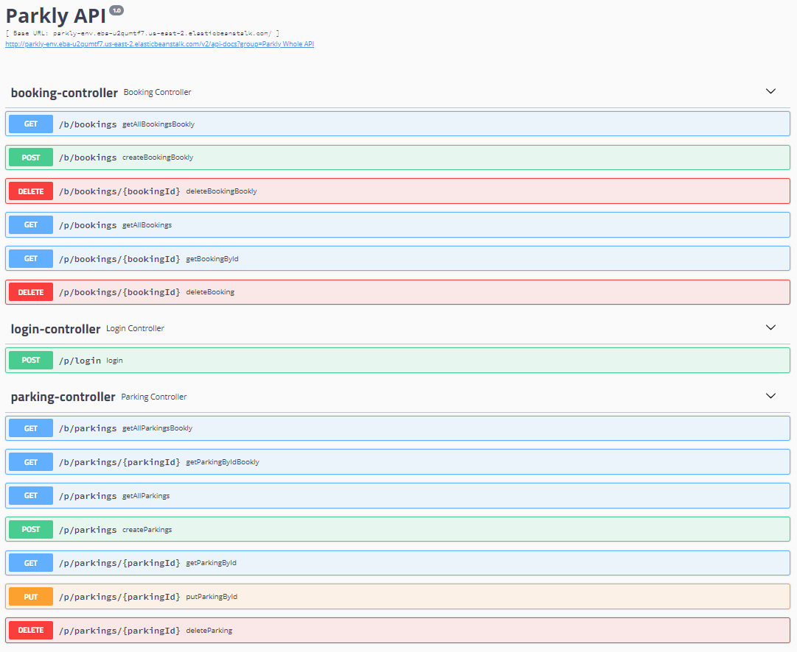
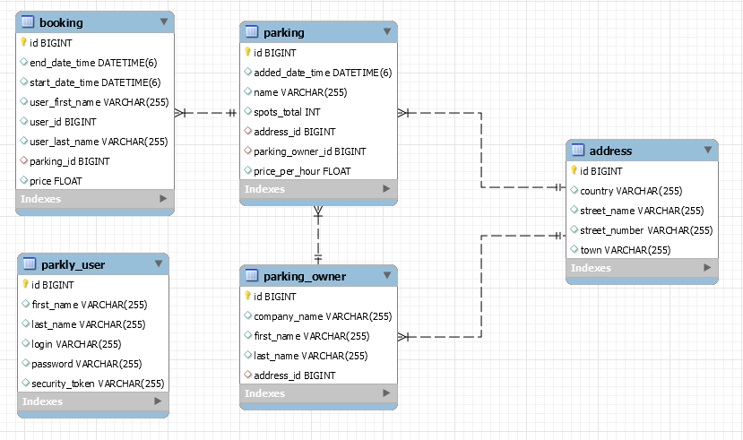

# Parkly
System allowing for parking slots reservation (mobile app, web app, backend)
Designed to be a subsystem for general booking system developed by different team allowing to book parking slots, cars and flats.

## Team members:
- Mateusz Szymoński
- Daniel Pławiak
- Łukasz Zalewski
- Piotr Brysiak
- Antoni Karpiński

## Components
* `/Backend` - backend Java + MySQL application
* `/WebApp` - web React application
* `/MobileAppForExpo` - mobile React Native application

